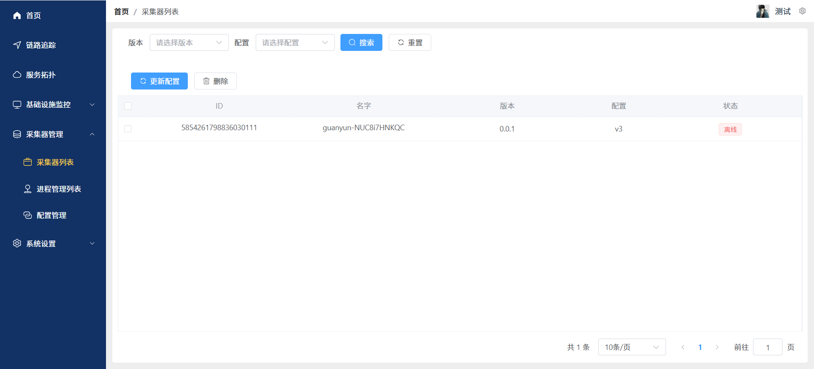
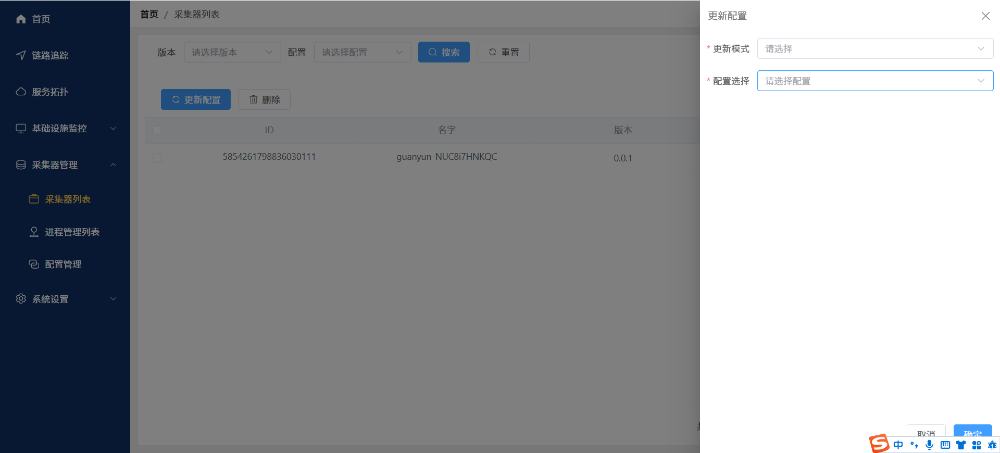
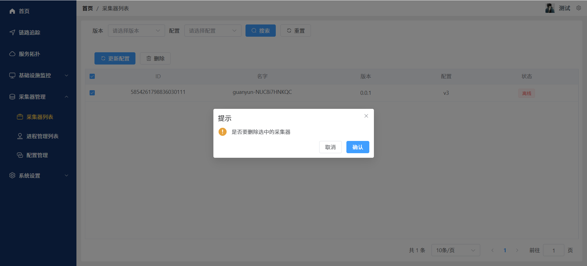

# 采集器管理--采集器列表
本文档将指导您如何使用采集器列表功能，包括采集器的筛选、更新配置、删除功能
### 点击左侧导航栏“采集器管理-采集器列表”，进入采集器列表页面
- 查询采集器
版本选择框：选择版本以查找特定采集器
配置选择框：选择配置以查找该配置的采集器
- 搜索按钮：点击进行搜索操作
- 重置按钮：清空搜索条件，显示所有采集器
- 支持分页显示，默认每页显示10条记录
  
- ### 点击“更新配置”按钮，弹出更新配置对话框
- 选择以下信息：
- 更新模式：请选择更新模式（必选）
  （1）选择全量-更新全部采集器
  （2）选择选中的-只更新选中的采集器
- 配置选择：请选择配置（必选）

### 删除采集器
- 在采集器列表中找到需要删除采集器
- 勾选采集器前边的复选框
- 点击页面顶部的“删除”按钮
- 在弹出的确认对话框中点击 “确定” 完成删除
