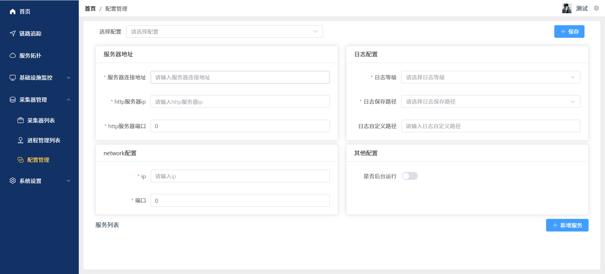
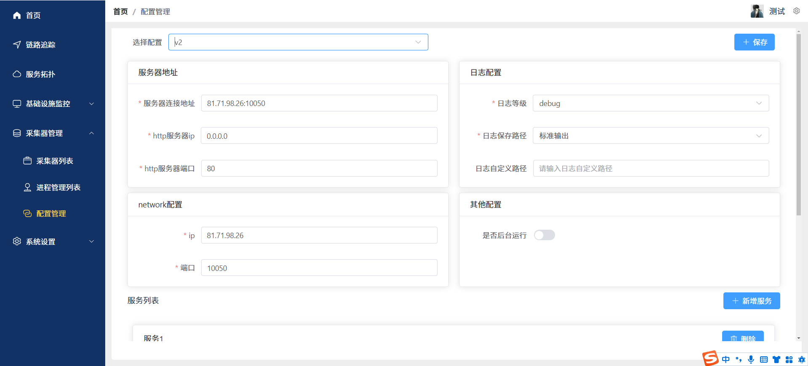
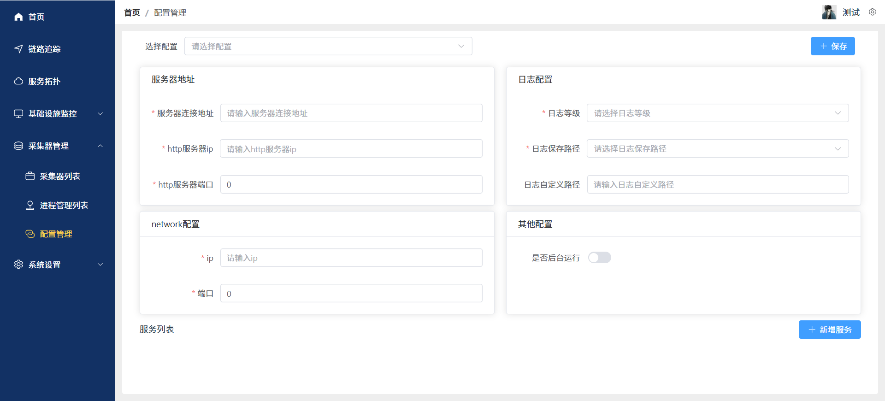
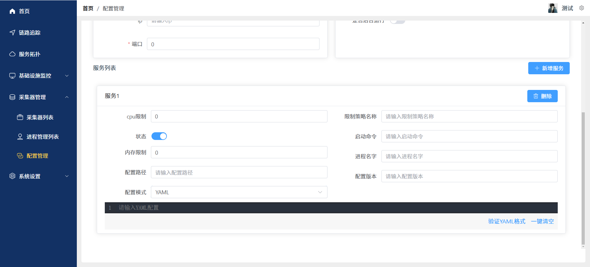
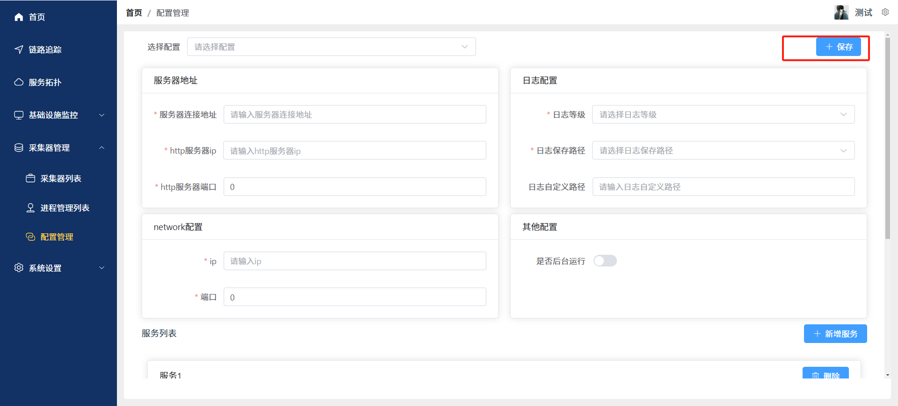

# 采集器管理--配置管理
本文档将指导您如何使用配置管理功能，包括配置保存功能
### 点击左侧导航栏“采集器管理-配置管理”，进入配置管理页面
- 选择配置
配置选择框：选择配置后配置信息会反显到页面上

- ### 配置信息填写
填写以下信息：
- ##### 服务器地址
- 服务器连接地址：请输入服务器连接地址（必填）
- http服务器ip：请输入http服务器ip（必填）
- http服务器端口：请输入http服务器端口（必填）
- ##### 日志配置
- 日志等级：请选择日志等级（必选）
- 日志保存路径：请选择日志保存路径（必选）
- 日志自定义路径：请填写日志自定义路径（填写后按自定义路径保存）
- ##### network配置
- ip：请填写ip
- 端口：请填写端口
- ##### network配置
- 是否后台运行：请选择是否后台运行

- ##### 服务列表（可以添加多个服务）
- cpu限制：请填写cpu限制
- 限制策略名称：请填写限制策略名称
- 状态：请选择状态
- 启动命令：请填写启动命令
- 内存限制：请填写内存限制
- 进程名字：请填写进程名字
- 配置路径：请填写配置路径
- 配置版本：请填写配置版本
- 配置模式：请选择配置模式（支持 YAML、JSON、文本框）
  

## 配置信息填写完成后点击顶部的‘保存’按钮 完成
