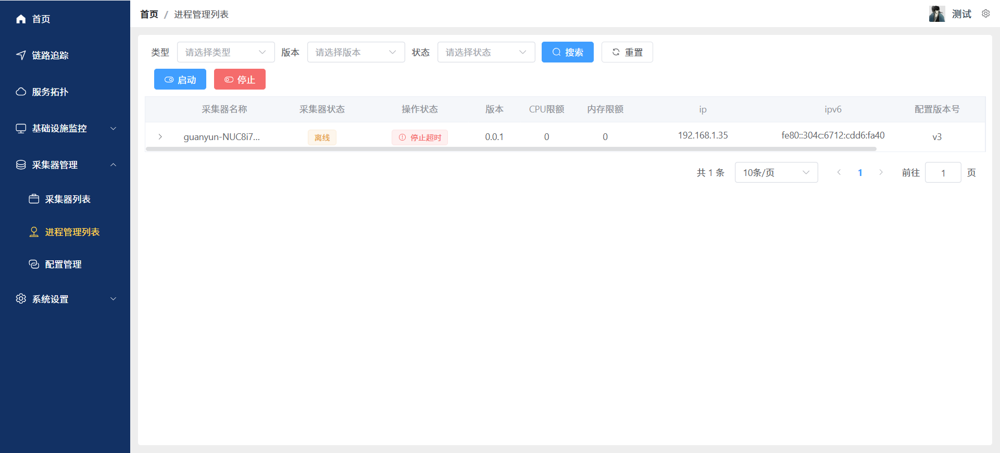
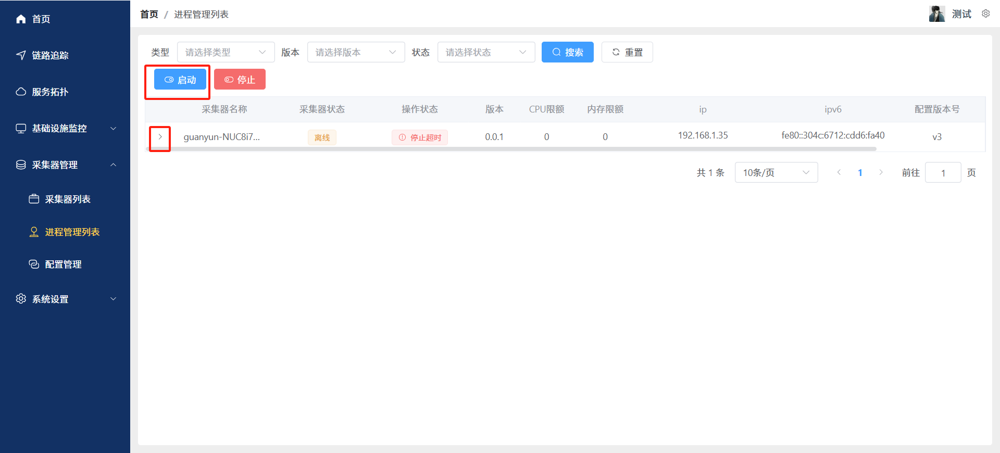
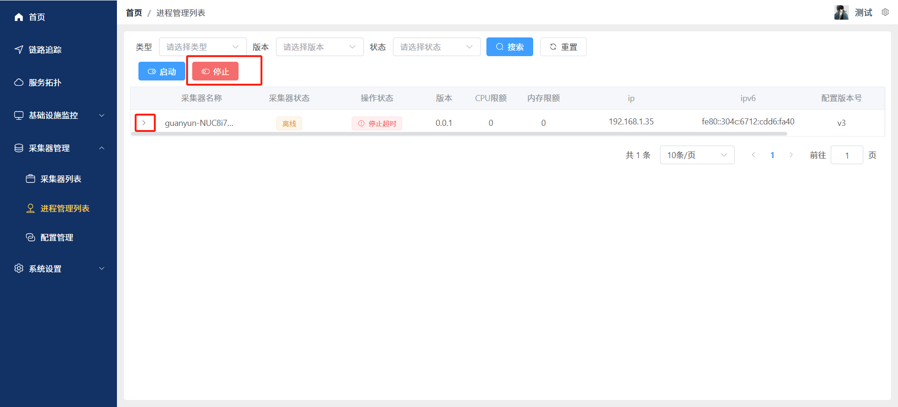

# 采集器管理--进程管理列表
本文档将指导您如何使用进程管理列表功能，包括进程的筛选、启动、停止功能
### 点击左侧导航栏“采集器管理-进程管理列表”，进入进程管理列表页面
- 查询进程
类型选择框：选择类型以查找特定类型的进程
版本选择框：选择版本以查找该版本的进程
状态选择框：选择状态以查找该状态的进程
- 搜索按钮：点击进行搜索操作
- 重置按钮：清空搜索条件，显示所有进程
- 支持分页显示，默认每页显示10条记录

- ### 批量启动进程
- 展开采集器
- 勾选 采集器下需要启动的进程前面的复选框
- 勾选后点击页面顶部的启动按钮
- 完成启动

### 批量停止进程
- 展开采集器
- 勾选 采集器下需要停止的进程前面的复选框
- 勾选后点击页面顶部的停止按钮
- 完成停止

- ### 单个进程启动
- 展开采集器
- 找到要启动的进程
- 点击进程后边的三个点图标
- 点击启动
- 完成启动
- ### 单个进程停止
- 展开采集器
- 找到要停止的进程
- 点击进程后边的三个点图标
- 点击停止
- 完成停止